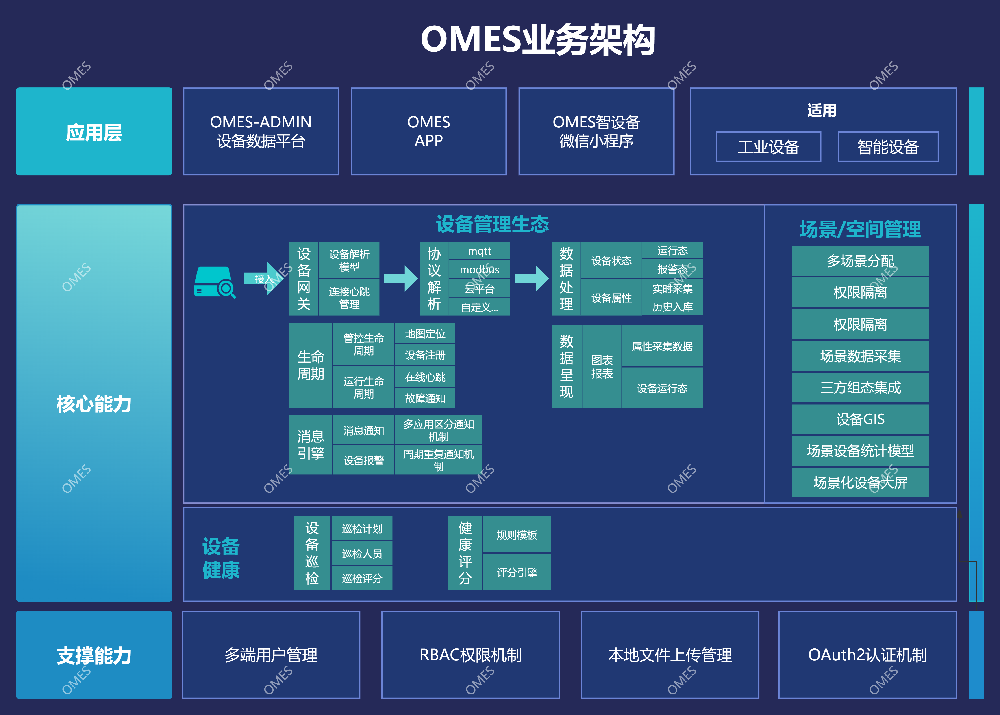

OMES 工业设备管理平台
===============

介绍
-----------------------------------
一套管理工业设备的平台生态。包括了OMES-admin管理平台、OMES智设备（移动端）。  
平台的主要目的是形成一套工业层面的设备生命周期管理、设备数据采集及分析、设备巡检、设备健康预测、场景化管理的适用于工程化的项目

交流与支持
-----------------------------------

- 微信： m15026681077
- 邮件： 434713950@163.com

版本对应表

| OMES Version | 变更内容               | Era Framework Version | Layui Version | Spring Boot Version | JAVA Version |
|:-------------|:-------------------|:---------------------|:--------------|:--------------------|:-------------|           
| 1.0.0-SNAPSHOT     | | 2024.0.1             | 2.9.27      | 3.4.5               | 21           |

---
进行中: 生产计划流程结合

> 项目依赖个人私有的框架包，无法下载直接运行。仅供开源功能参考，如需定制可联系我