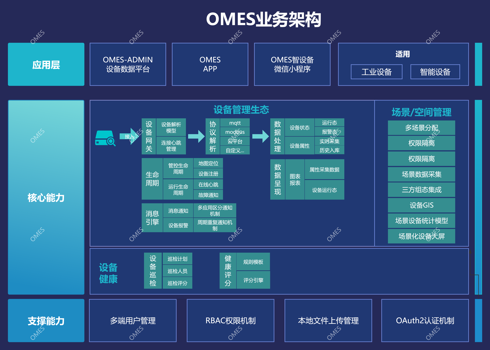

OMES 工业设备管理平台
===============

[]()
[]()
[]()

介绍
-----------------------------------
本平台聚焦工业设备管理领域，构建涵盖设备全生命周期管理、统一数据采集与治理、实时分析与建模的技术体系；基于智能巡检与设备健康评估模型，实现预测性维护与故障预警；并通过场景化建模与业务编排能力，支撑复杂工业场景下的数字化运营与决策优化


> 项目介绍：https://blog.ourexists.site/2026/01/30/omes/


平台生态
-----------------------------------
 * **omes-runner-admin**：Web 管理端（Spring Boot，应用名 `OMES-ADMIN`），聚合各业务域服务。
 * **omes-runner-control**：设备控制侧进程（默认端口 `10015`，应用名 `OMES-CONTROL`）。
 * **omes-flinker-equip（omes-stream）**：Flink 实时流作业，消费 RabbitMQ 并与管理端队列协同。
 * **omes-ai / omes-ai-web**：AI 相关能力与前端（详见各子目录说明）。


交流与支持
-----------------------------------

- 微信： m15026681077
- 邮件： 434713950@163.com

版本对应表

| OMES Version     | 变更内容 | Era Framework Version | Layui Version | Spring Boot Version | JAVA Version |
|:-----------------|:---------|:----------------------|:--------------|:--------------------|:-------------|
| 1.0.0-SNAPSHOT   |          | 2024.0.1              | 2.9.27        | 3.4.5               | 21           |



使用说明
-----------------------------------

### 1. 环境要求

- **JDK 21**（与版本表一致；Flink 作业模块单独要求 JDK 17，见 `omes-flinker-equip/README.md`）。
- **Maven 3.8+**（构建）。
- **PostgreSQL**（默认激活 `db-postgres`；亦支持 MySQL、SQL Server、SQLite 等 profile，见 `omes-runner-admin/src/main/resources/application-db-*.yml`）。
- **Redis**（会话与缓存等）。
- **RabbitMQ**（设备实时流、Spring Cloud Stream 与 Flink 侧需同一套连接与 vhost）。

### 2. 本地配置

仓库根目录下的 **`config/config.properties`** 会被启动类加载（`@PropertySource("file:config/config.properties")`），用于数据库等关键变量，例如：

- `db_host`、`db_schema`、`db_username`、`db_password`
- 按需覆盖 **Redis**、**RabbitMQ** 等（亦可通过同名环境变量注入，见 `omes-runner-admin/src/main/resources/application.yml`）

**运行时的当前工作目录**需能解析到上述 `config` 路径（一般在仓库根目录启动，或将 `config` 目录拷到与进程一致的位置）。

### 3. 构建

在仓库根目录执行（需能解析父 POM 与 **Era** 等依赖；若缺少私有制品仓库会构建失败）：

```bash
mvn clean package -DskipTests
```

管理端可执行包路径：`omes-runner-admin/target/omes-runner-admin-*.jar`（具体文件名以构建输出为准）。

### 4. 启动管理端（omes-runner-admin）

- **默认端口**：`10010`（可通过 `-Dserver.port=` 或环境变量覆盖）。
- **主类**：`com.ourexists.omes.App`。  
  启动前会检测本机该端口是否已有实例：若已有则尝试打开浏览器并退出，避免重复启动。

**IDEA**：运行配置中 Main class 填 `com.ourexists.omes.App`，**Working directory** 设为**仓库根目录**（保证 `config/config.properties` 可读）。

**命令行示例**（在仓库根目录，保证 `./config` 存在）：

```bash
java -jar omes-runner-admin/target/omes-runner-admin-1.0.0-SNAPSHOT.jar
```

或使用 Spring Boot 插件（同样在仓库根执行便于读取 `config`）：

```bash
mvn -pl omes-runner-admin spring-boot:run
```

访问：**http://127.0.0.1:10010/**（端口以实际为准）。

### 5. JVM 模块开放（Flink / Chill 反射，JDK 17+）

`omes-runner-admin` 内嵌 Flink `RMQSource` 相关逻辑时，需在 JDK 模块系统下开放 `java.base` 的部分包给反射使用。

1. **IDEA**：在对应 Run Configuration 的 **VM options** 中增加：

```text
--add-opens=java.base/java.util=ALL-UNNAMED --add-opens=java.base/java.lang=ALL-UNNAMED
```

2. **`java -jar` / 生产启动**：可在命令行追加相同参数，或通过环境变量统一注入：

```text
JAVA_TOOL_OPTIONS=--add-opens=java.base/java.util=ALL-UNNAMED --add-opens=java.base/java.lang=ALL-UNNAMED
```

3. **现象**：若未配置，RabbitMQ 消费线程可能出现 `InaccessibleObjectException: module java.base does not "opens java.util" ...` 并反复重启。

> 说明：`omes-runner-admin` 的 `maven-jar-plugin` 中已写入 `Add-Opens` 清单项；**在 IDE 中直接运行 `main` 时仍建议手动加上述 VM 参数**，行为以实际 JDK / 打包方式为准。

### 6. Flink 实时作业（可选）

设备实时流由 **`omes-flinker-equip`** 打包为 Flink 作业提交运行，与 RabbitMQ、管理端配置的队列名需一致。构建、提交方式与环境变量说明见：

- **`omes-flinker-equip/README.md`**

### 7. 其他进程（可选）

- **omes-runner-control**：设备控制相关服务，默认端口 **`10015`**，配置见 `omes-runner-control/src/main/resources/application.yml`。
- **omes-ai-web**：Next.js 前端，启动方式见 **`omes-ai-web/README.md`**；后端 **`omes-ai`** 默认与管理端通过 `AI_APP_BASE_URL` 等配置协同。

---

进行中：生产计划流程结合

> 项目依赖个人私有的框架包，无法下载直接运行。仅供开源功能参考，如需定制可联系我。

